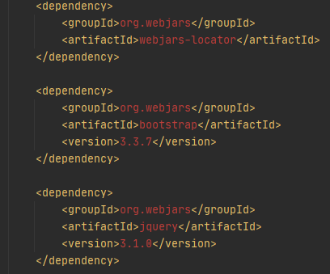
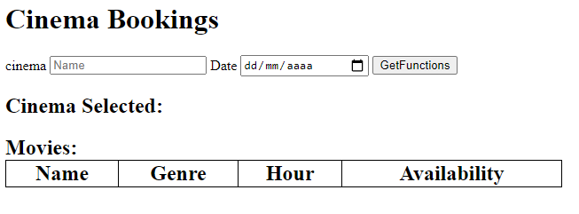
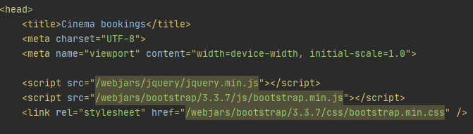
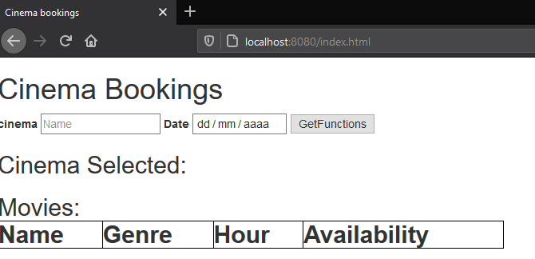
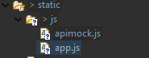
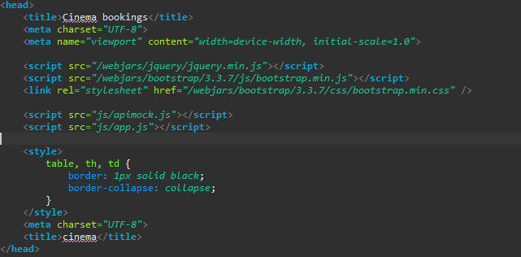

# ARSW - Laboratorio - 5

Comandos para ejecutar la aplicación

```
mvn clean compile
```

```
mvn spring-boot:run
```
 
## Descripción y objetivos

* Crear un cliente que se conecte con el API Rest generado anteriormente de manera que se pueda interactuar con él desde el navegador.
* Al oprimir el botón 'Get Functions', consultar las funciones de un determinado cine y una fecha dados por el usuario. Por ahora, si la consulta genera un error, sencillamente no se mostrará nada.
* Al hacer una consulta exitosa, se debe mostrar un mensaje que incluya el nombre del cine, y una tabla con: el nombre de la película, el género, la hora de la función y un botón para abrir el detalle de la disponibilidad de la misma.
* Al seleccionar una de las funciones se debe mostrar el dibujo de la disponibilidad de la misma. Por ahora, el dibujo será simplemente una serie de cuadrados en pantalla que representan las sillas, y dependiendo de su disponibilidad tendrán un color distinto.

## Parte I - Ajustes Backend
* Trabaje sobre la base del proyecto anterior una vez solucionado (REST-API Cinema).
* Incluya dentro de las dependencias de Maven los 'webjars' de jQuery y Bootstrap (esto permite tener localmente dichas librerías de JavaScript al momento de construír el proyecto):



## Parte II - Front-End - Vistas

1. Cree el directorio donde residirá la aplicación JavaScript. Como se está usando SpringBoot, la ruta para poner en el mismo contenido estático (páginas Web estáticas, aplicaciones HTML5/JS, etc) es:

2. Cree, en el directorio anterior, la página index.html, sólo con lo básico: título, campo para la captura del nombre del cine, un campo de captura tipo fecha, botón de 'Get Functions', campodonde se mostrará el nombre del cine seleccionado, la tabla HTML donde se mostrará el listado de funciones (con sólo los encabezados). Recuerde asociarle identificadores a dichos componentes para facilitar su búsqueda mediante selectores.



3. En el elemento <head> de la página, agregue las referencia a las librerías de jQuery, Bootstrap y a la hoja de estilos de Bootstrap.



4. Suba la aplicación (mvn spring-boot:run), y rectifique:
	1. Que la página sea accesible desde: http://localhost:8080/index.html
	
	
	
	2. Al abrir la consola de desarrollador del navegador, NO deben aparecer mensajes de error 404 (es decir, que las librerías de JavaScript se cargaron correctamente).

## Parte III - Front-End - Logica

1. Ahora, va a crear un Módulo JavaScript que, a manera de controlador, mantenga los estados y ofrezca las operaciones requeridas por la vista. Para esto tenga en cuenta el patrón Módulo de JavaScript, y cree un módulo en la ruta static/js/app.js

2. Copie el módulo provisto (apimock.js) en la misma ruta del módulo antes creado. En éste agréguele más planos (con más puntos) a los autores 'quemados' en el código.



3. Agregue la importación de los dos nuevos módulos a la página HTML (después de las importaciones de las librerías de jQuery y Bootstrap):



4. Haga que el módulo antes creado mantenga de forma privada:
	* El nombre del cine seleccionado.
	* La fecha de las funciones a consultar
	* El listado de nombre, género y hora de las películas de las funciones del cine seleccionado. Es decir, una lista objetos, donde cada objeto tendrá tres propiedades: nombre de la película, género de la misma y hora de la función.
Junto con dos operaciones públicas, una que permita cambiar el nombre del cinema actualmente seleccionado y otra que permita cambiar la fecha.


